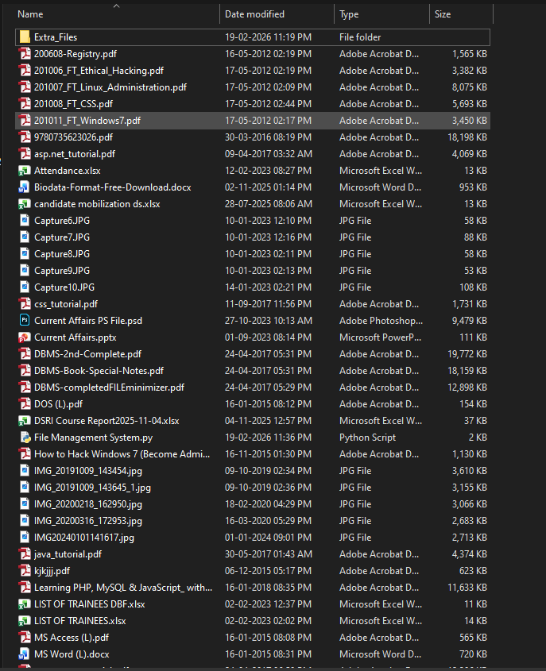
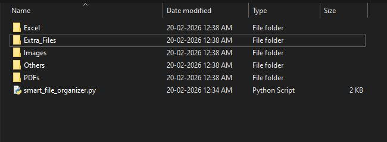
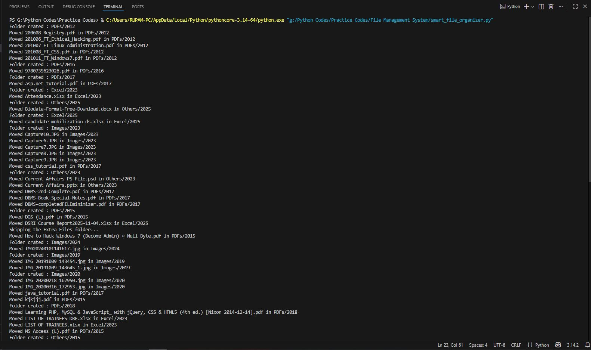
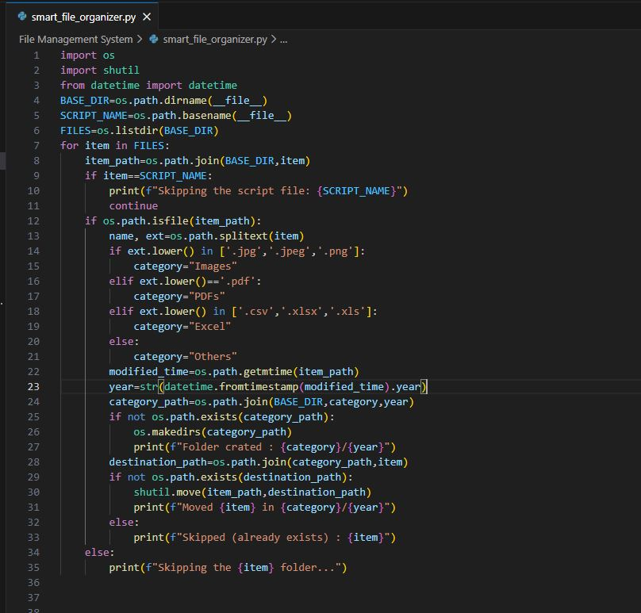

# Smart File Organizer – Python Automation Project

## 📖 Overview

A Python-based automation tool that organizes messy folders into structured category and year-based directories.

---

## 🚀 Problem

Manual file organization is time-consuming and error-prone.  
Users often have mixed file types in a single folder.

---

## 🛠 Solution

This script automatically:

- Detects file types
- Categorizes files (Images, PDFs, Excel, Others)
- Organizes by modification year
- Prevents accidental overwriting
- Skips system/script files
- Safe for repeated execution

---

## 🖼 Before Execution

---

## 🖼 After Execution

---

## 💻 Execution Output

---

## 🧠 Code Preview

---

## 🛠 Technologies Used

- Python
- os
- shutil
- datetime

---

## 💼 Business Value

Reduces manual file organization time and ensures structured file management.
